

  

<h1 align="center">osTicket Help Desk Configuration (Service Desk Design & Workflow Control)</h1>

This project focuses on transforming a default osTicket installation into a structured help desk system by controlling access, ownership, ticket flow, and response expectations.

The objective was not configuration for its own sake, but creating a system where tickets are routed, restricted, and resolved predictably.

---

## 📌 Context

A default osTicket installation provides basic functionality but lacks structure:

- No enforced ownership boundaries  
- Unrestricted visibility across tickets  
- No response expectations  
- No consistent ticket intake  

This project addressed those gaps by designing a controlled service environment.

---

## 🧰 Technologies Used

- osTicket  
- PHP  
- MySQL  
- Web-based administrative interface  
- Role-Based Access Control (RBAC)  
- SLA policy configuration  

---

## 💻 Environment

- Local osTicket instance  
- Admin Panel: `http://localhost/osTicket/scp/login.php`  
- End User Portal: `http://localhost/osTicket`  

Configured system areas:

- Agents / Roles  
- Agents / Departments  
- Agents / Teams  
- User Settings  
- SLA Policies  
- Help Topics  

---

## ⚙️ Implementation

### 1. Access Separation

**Problem:**  
Default system does not clearly separate administrative control from user interaction.

**Decision:**  
Validate and enforce separation between admin panel and user portal.

**Result:**  
- Administrative actions isolated from user access  
- Reduced risk of misconfiguration through user exposure  

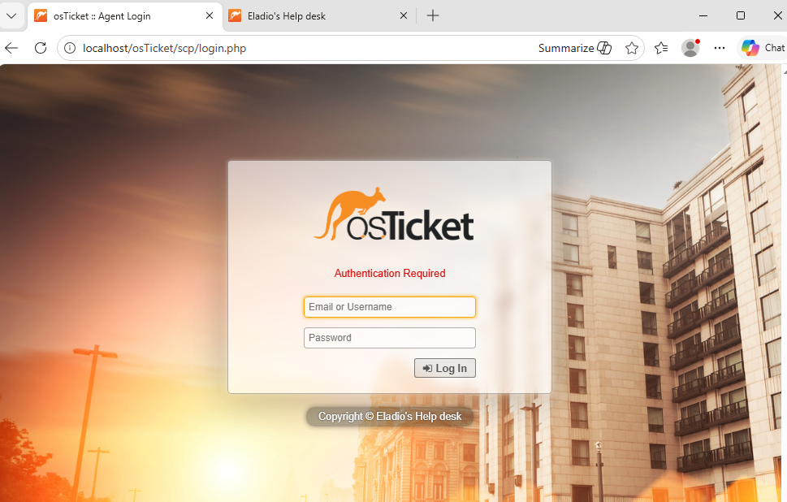

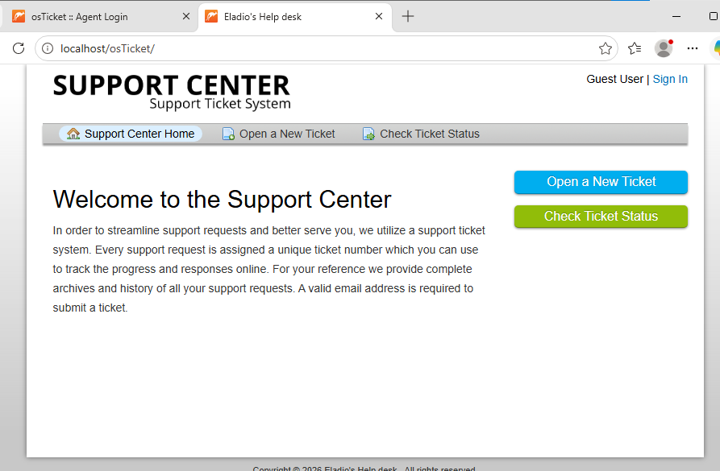

---

### 2. Admin vs Agent Responsibilities

**Problem:**  
Unclear separation between system configuration and ticket handling.

**Decision:**  
Define clear distinction between:
- Admin Panel (system control)  
- Agent Panel (ticket operations)  

**Result:**  
- Configuration and operations separated  
- Reduced risk of operational errors affecting system settings  

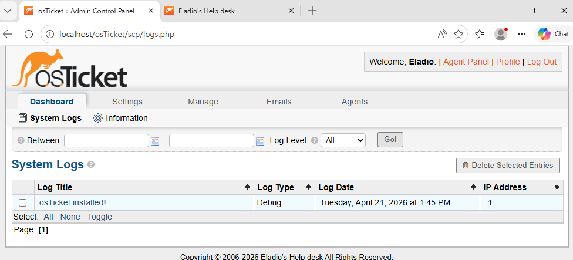

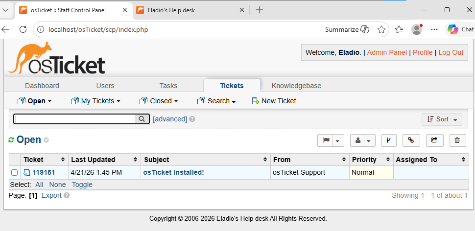

---

### 3. Role-Based Access Control

**Problem:**  
Unstructured permissions can lead to excessive or incorrect access.

**Decision:**  
Simplify roles and enforce controlled access using a single high-privilege admin role.

**Result:**  
- Reduced permission complexity  
- Clear control over administrative capabilities  

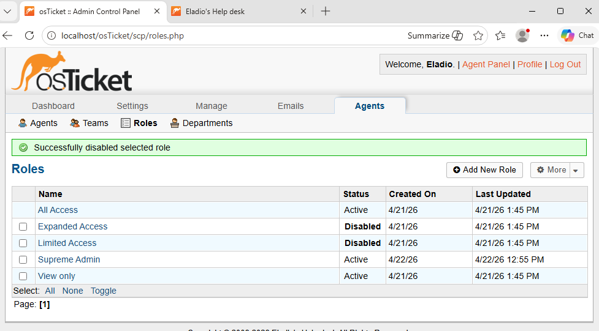

---

### 4. Department Segmentation

**Problem:**  
Default setup allows broad ticket visibility.

**Decision:**  
Create departments (e.g., SysAdmins) to enforce ownership boundaries.

**Result:**  
- Tickets restricted to relevant teams  
- Improved accountability and ownership  

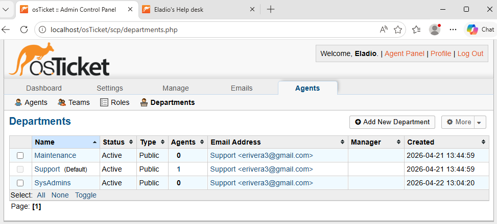

---

### 5. Cross-Functional Teams

**Problem:**  
Departments alone limit collaboration across services.

**Decision:**  
Introduce teams (e.g., Online Banking) to group agents across departments.

**Result:**  
- Flexible collaboration model  
- Support organized by service, not just department  

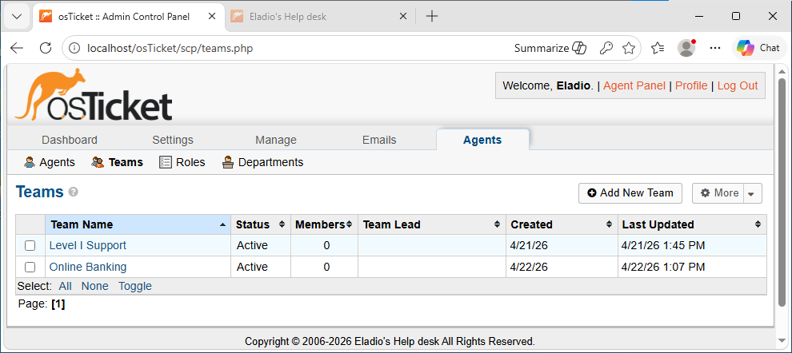

---

### 6. User Access Control

**Problem:**  
Open ticket submission reduces accountability.

**Decision:**  
Require authentication before ticket creation.

**Result:**  
- Controlled ticket intake  
- Improved traceability of requests  

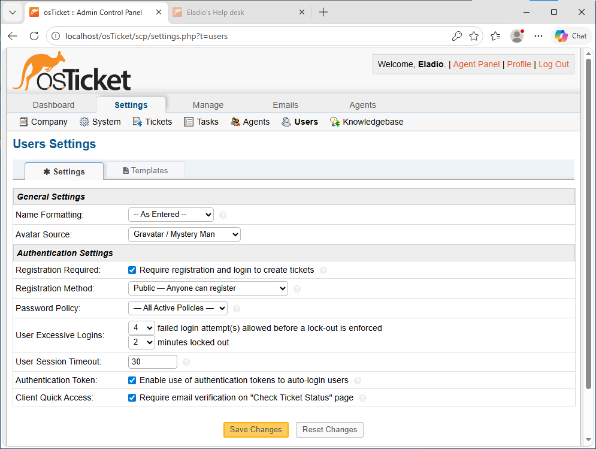

---

### 7. Agent & User Provisioning

**Problem:**  
No defined interaction between users and support staff.

**Decision:**  
Create agents and users to simulate real workflows.

**Result:**  
- Functional request-response system  
- Realistic support interactions  

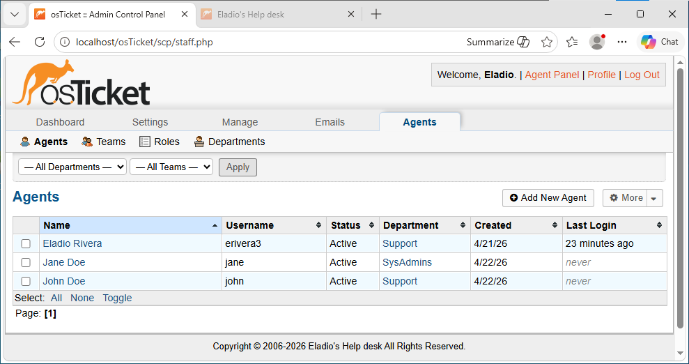

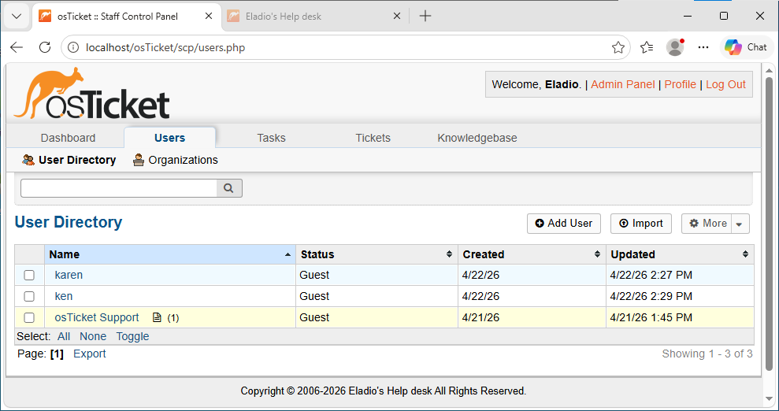

---

### 8. SLA Policy Enforcement

**Problem:**  
No defined response expectations.

**Decision:**  
Implement SLA policies:

- Sev-A: 1 hour  
- Sev-B: 4 hours  
- Sev-C: 8 hours  

**Result:**  
- Enforced response timelines  
- Prioritized ticket handling  

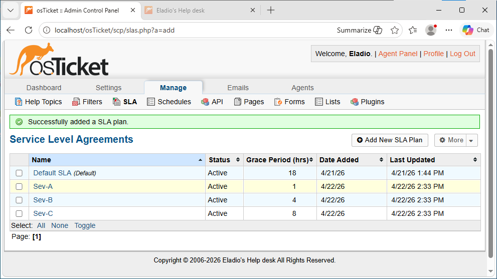

---

### 9. Ticket Intake Structuring

**Problem:**  
Unstructured ticket submission leads to inconsistent routing.

**Decision:**  
Define help topics:

- Business Critical Outage  
- Personal Computer Issues  
- Equipment Request  
- Password Reset  
- Other  

**Result:**  
- Consistent ticket categorization  
- Improved routing efficiency  

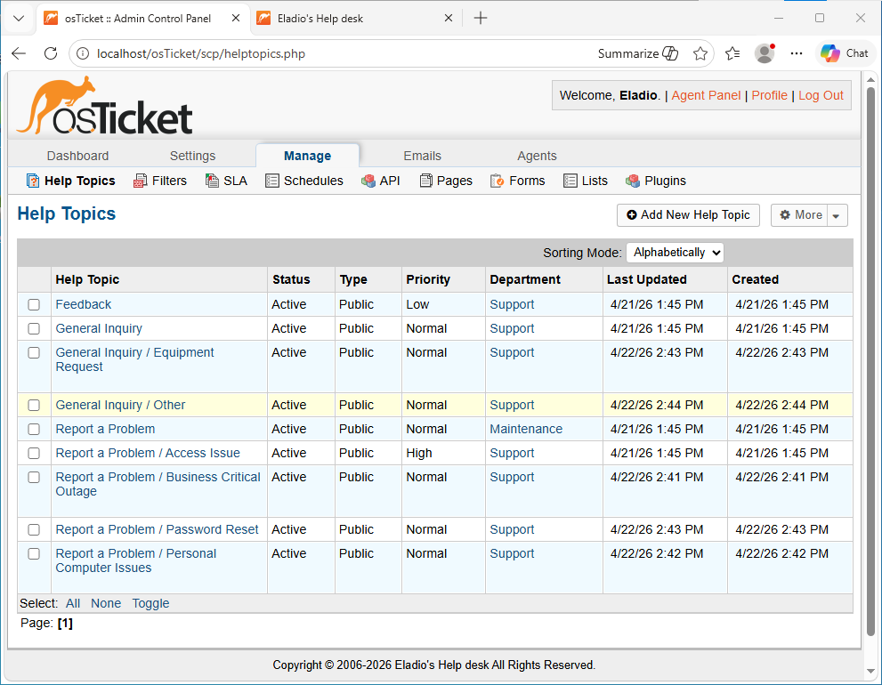

---

## 🔍 Key Failures & Corrections

### Admin vs Agent Panel Confusion
- Cause: Misunderstanding interface separation  
- Fix: Verified context before configuration  

### Roles vs Departments Misnavigation
- Cause: Similar UI structure  
- Fix: Confirmed correct configuration layer  

### Ticket Access Policy Conflict
- Cause: Misinterpreted user settings  
- Fix: Enforced authentication requirement  

---

## 🧠 Decisions That Mattered

- Enforced authentication to prevent uncontrolled ticket intake  
- Used departments to enforce ownership boundaries  
- Introduced teams to enable collaboration without removing structure  
- Applied SLAs to define response expectations  
- Simplified roles to reduce permission complexity  

---

## 🛡️ System Understanding

- Roles control permissions, not ticket visibility  
- Departments control ownership and access  
- Teams enable collaboration without flattening structure  
- SLA policies enforce operational accountability  
- Configuration determines system behavior, not just installation  

---

## 📌 Key Lessons

- Installation does not create a usable system  
- Access control defines system reliability  
- Structure determines workflow efficiency  
- Misconfiguration impacts behavior across the system  

---

## Summary

This project demonstrates the ability to take a default system and transform it into a controlled service environment.

Key outcomes:

- Defined ownership and access boundaries  
- Enforced structured ticket intake and routing  
- Introduced measurable response expectations  
- Built a system that reflects real-world help desk operations  

**Result:**  
A configured service desk where ticket flow, visibility, and response behavior are controlled rather than left to default behavior.
